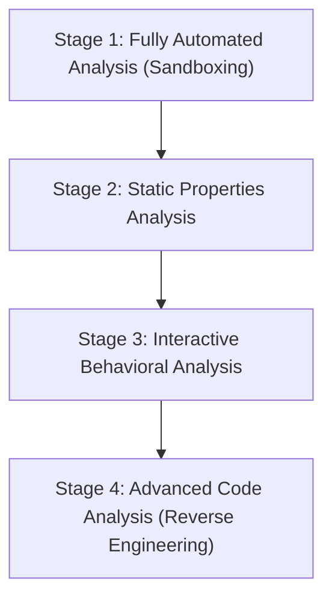

# Malware Analysis Resources & Methodology

This document serves as a comprehensive resource guide and methodology framework for performing malware analysis within an Agentic SOC or security research environment. It details the analysis stages, toolsets, sandbox configurations, and reporting procedures.

---

## 1. Malware Analysis Stages

Malware analysis is typically categorized into four progressive stages, each offering a deeper level of insight into the artifact's behavior and inner workings.

| Stage | Analysis Type | Description | Key Indicators Collected |
| :--- | :--- | :--- | :--- |
| **Stage 1** | **Fully Automated** | Running the file in an automated sandbox to generate dynamic reports. | Behavior scores, screenshots, raw PCAPs, high-level API logs. |
| **Stage 2** | **Static Properties** | Examining metadata, headers, strings, and hashes without executing the binary. | Hashes (MD5, SHA-256, ssdeep), PE structure, imports, packed status. |
| **Stage 3** | **Interactive Behavioral** | Running the malware in a controlled lab while interacting with it and monitoring system states. | Registry changes, process creation, network callbacks, dropped files. |
| **Stage 4** | **Advanced Code** | Disassembling and debugging the binary using a debugger/decompiler to map instructions. | Decryption routines, anti-analysis loops, custom protocol schemas. |

---

## 2. Lab Architecture & Safety

> [!WARNING]
> Always analyze malware within a dedicated, isolated virtualization environment. Running malware on host systems or improperly configured virtual machines can result in network propagation or host contamination.

### Recommended Lab Configuration

1. **Hypervisor**: Oracle VM VirtualBox or VMware Workstation/Player.
2. **Network Isolation**: Use a **Host-Only Adapter** or an isolated virtual LAN. Never use NAT or Bridged mode on active malware VMs.
3. **Services Simulation**:
   - Use **INetSim** (on a Linux helper VM like REMnux) to simulate common internet protocols (DNS, HTTP, SMTP, HTTPS) so the malware attempts network actions without reaching the real internet.
   - Use **ApateDNS** or local hosts redirection to redirect traffic to your analyzer VM.
4. **State Restoration**: Take clean snapshots of your analyzer VMs *before* executing any malware, and revert to these snapshots after every analysis run.

---

## 3. Malware Analysis Tooling Index

Below is a curated index of industry-standard tools categorized by their primary role in the analysis pipeline.

### Static Analysis Tools

*   **PEStudio**: Essential tool for static analysis of Portable Executable (PE) files. Identifies anomalous headers, imports, exports, and embedded resources.
*   **PEview**: Light utility to inspect the internal structure of PE files (sections, headers, directories).
*   **CFF Explorer**: A PE editor that supports analyzing headers, imports, exports, and rebuilding PE structures.
*   **FLOSS (FireEye Labs Obfuscated String Solver)**: Uses advanced static analysis to automatically detect and extract obfuscated/encoded strings from binaries.
*   **Detect It Easy (DIE)**: A program for determining file types and identifying packers, compilers, and obfuscation signatures.

### Dynamic & Behavioral Analysis Tools

*   **Process Monitor (Procmon)**: Real-time monitoring tool for Windows file system, registry, process, thread, and DLL activity.
*   **Process Explorer (Procexp)**: Advanced task manager showing active processes, their DLLs, handles, and digital signature status.
*   **Wireshark**: Packet analyzer used to capture and deeply inspect network traffic generated by the malware.
*   **Regshot**: Registry comparison utility that takes a "before" and "after" snapshot of the system registry to identify changes made during execution.
*   **TCPView**: Displays detailed listings of all TCP and UDP endpoints on the system, mapping connections directly to process names.

### Reverse Engineering & Code Analysis (Stage 4)

*   **Ghidra**: An open-source software reverse engineering (SRE) suite developed by the NSA. Features a powerful decompiler for multi-architecture binaries.
*   **IDA Pro / IDA Free**: The industry-standard interactive disassembler and debugger.
*   **x64dbg / x32dbg**: Open-source x64/x32 debuggers for Windows. Ideal for stepping through active execution, patching code, and resolving packed payloads in memory.
*   **Cutter**: A GUI frontend for Rizin (a fork of radare2), offering an intuitive disassembler interface.

### Memory Forensics

*   **Volatility Framework**: Advanced CLI framework for memory forensics. Used to analyze RAM dumps from infected systems to find injected code, open sockets, and hidden processes.
*   **WinDbg**: Microsoft's kernel-mode and user-mode debugger, useful for deep OS inspection and debugging kernel-level malware (drivers).

---

## 4. Analytical Workflow (Step-by-Step)

Follow this structured playbook to analyze an unknown suspicious file:

### Step 1: Pre-Execution static examination
1. Compute hashes (MD5, SHA-256) and search them in VirusTotal or Threat Intelligence databases.
2. Inspect headers using **PEStudio** to check for high-entropy sections (indicating packing/encryption).
3. Extract strings using `strings` or **FLOSS** to locate hardcoded domains, IPs, user-agents, or registry keys.
4. Review imported DLLs (e.g., `kernel32.dll`, `ws2_32.dll`) and their imported functions (e.g., `VirtualAlloc`, `WriteProcessMemory`, `CreateRemoteThread`) to gauge capabilities.

### Step 2: Set up behavioral monitoring
1. Start **Process Monitor** (configure filters to exclude safe system activity).
2. Start **Wireshark** on the network interface.
3. Start **Regshot** and take the initial snapshot.
4. Launch **Process Explorer** to watch the process tree in real-time.

### Step 3: Execution and interactive capture
1. Run the malware (as Administrator if required) in the sandbox environment.
2. Interact with any prompts or allow the program to run for 3-5 minutes.
3. Terminate the process (or let it terminate itself).
4. Stop the packet capture and Process Monitor logs.
5. Take the second **Regshot** snapshot and generate the registry delta report.

### Step 4: Post-execution analysis
1. Filter the **Procmon** log to see only files written, processes created, and registry keys modified.
2. Inspect the **Wireshark** capture for DNS requests, HTTP POST/GET requests, or anomalous TCP/UDP connections.
3. If new files were dropped, extract them and run them through Step 1.
4. If code injection is suspected, use **Process Explorer** to dump the process memory space, or capture a RAM dump and analyze it via **Volatility**.

---

## 5. Integration with Agentic SOC

In an automated or agent-assisted SOC:
- **Triage Agent** can query static property extraction APIs to flag packed files or malicious imports.
- **Investigation Agent** can spin up sandbox API tasks (e.g., Joe Sandbox or Hatching Triage) and parse the resulting JSON reports for network indicator indicators (IOCs).
- **Response Agent** uses these IOCs to generate blocklists, YARA signatures, or firewall policies.
