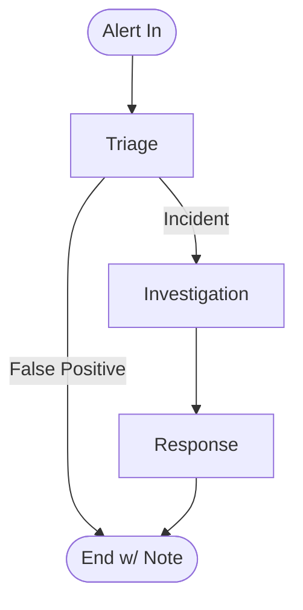

# Agentic SOC Reference Architecture

This repository contains a reference implementation of an Agentic Security Operations Center (SOC) using **LangChain** and **LangGraph**.

It demonstrates a multi-agent workflow where specialized AI agents collaborate to handle security alerts:

1.  **Triage Agent**: Analyzes raw alerts to determine severity and validity.
2.  **Investigation Agent**: Gathers context using (mock) security tools like SIEM logs and Threat Intel.
3.  **Response Agent**: Proposes remediation actions based on the investigation.

## Architecture



## Features

- **Stateful Workflow**: Uses `LangGraph` to maintain context (alert data, investigation findings) across agent steps.
- **Mock Tools**: Includes simulated tools for `search_logs`, `virustotal_lookup`, and `firewall_block_ip` to demonstrate tool use without needing live API keys.
- **Extensible**: Designed to be easily adapted to real integrations (Splunk, Microsoft Sentinel, etc.).

## Setup

1.  Clone the repository.
2.  Install dependencies:
    ```bash
    pip install -r requirements.txt
    ```
3.  Run the demo:
    ```bash
    python main.py
    ```

## Project Structure

- `main.py`: Entry point for the simulation.
- `soc/`: Core package.
    - `graph.py`: Defines the LangGraph workflow.
    - `state.py`: Defines the shared application state.
    - `agents/`: Agent implementations (prompts and logic).
    - `tools/`: Tool definitions.
 
## EC COUNCIL GITHUB

- https://github.com/ec-council-learning/Agentic-AI-for-Cybersecurity
